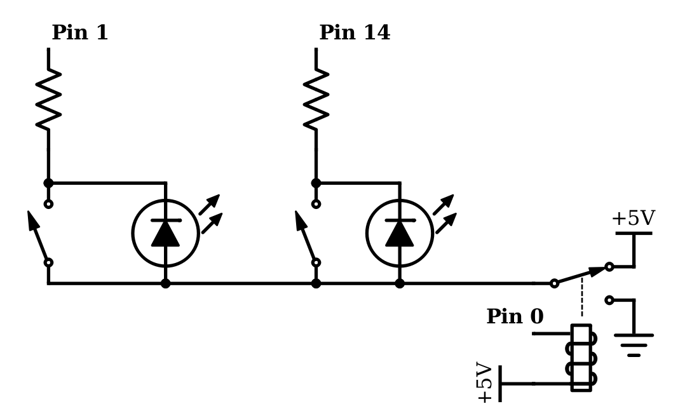

# Voting machine

Reduce the time spent managing tokens and cards for voting while playing
[The Resistance: Avalon](https://boardgamegeek.com/boardgame/128882/resistance-avalon).

## How to use it

Startup:
1. Connect the player controllers to the coordinator.
2. Connect the coordinator to power.
3. Have everyone push one of the buttons on their controller.
4. Push the button on the coordinator once.
5. Each players controller should light up.

To start a public vote, i.e., determine if a group of players selected by the
leader will go on a quest, press the coordinator button once. All the lights
will turn off and everyone can cast their vote. Once all votes have been cast
the controllers will light up showing each players' vote.

To start a private vote, i.e., decide if a quest succeeds or fails, press the
coordinator button once for each player going on the mission. Each player on
the mission can then vote and once all votes have been cast the controllers of
players who voted will light up, but the results of the votes will be shuffled
among players to maintain anonymity.

## How to build it

### Parts

- 2x10 LEDs and matching resistors. I used 10 red and 10 green.
- 20 small buttons. I used [these](https://www.adafruit.com/product/3101) but
  would recommend something with more feedback.
- 10 [3.5mm audio cables](https://www.adafruit.com/product/876) and [jacks](https://www.adafruit.com/product/1699)
- 1 [perf-board](https://www.adafruit.com/product/1606)
- 1 [big button](https://www.adafruit.com/product/473)
- 1 [Teensy 3.1](https://www.pjrc.com/teensy/teensy31.html)
- 1 SPDT relay
- Odd and ends - rubber feet, wire, etc.

### Physical components

- Convert the .scad files in to .stl files with
  [OpenSCAD](http://www.openscad.org/).
- Print 10 copies of the controller.
- You'll need one coordinator, but you'll likely need to modify it to fit your
  layout of the components.
- I glued a sheet of rubber to the button of each controller to prevent them
  from sliding and help determine which side is which.
- I attached the coordinator case to the circuit board with zip ties.

### Wiring

The diagram above shows the wiring of one of the controllers. All of the
controllers share the wire from the relay. The relay can be omitted if each
controller is given a dedicated pin on the microcontroller for the pin for that
wire, however on the Teensy 3.1 this means using the surface mount headers.
Pin 1 and 14 on the diagram increment for each additional controller.

Each controller was partially assembled and soldered together. Each LED can be
attached diagonally across the back of the corresponding button. The
coordinator was assembled on perf-board.

### Programming

You'll need two libraries,
[Bounce2](https://github.com/thomasfredericks/Bounce2) and
[Entropy](https://github.com/pmjdebruijn/Arduino-Entropy-Library). I compiled
and uploaded coordinator.c with
[Arduino](https://www.arduino.cc/en/Main/Software).

## How to improve it

- Buttons on the controllers need some feedback. I choose soft buttons to avoid
  making it detectable when people vote, but its not clear to players that
  their vote has been cast.
- Automatic registration of players at startup.
- Wireless controllers would be cool.

## License

Copyright (c) 2017 Kevin Stock

Distributed under [the MIT license](LICENSE).
